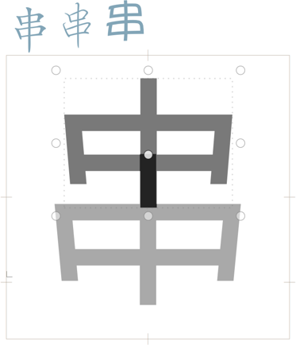

# ShowCharacter

Glyphs.app plug-in for displaying samples of installed fonts for the glyph you are editing. After installation, turn it on or off by choosing *View > Show Character* (de: *Zeichen anzeigen,* fr: *Affiche caractère,* zh: 👩‍🏫参考字). This can be helpful especially for CJK glyphs where the glyph names are not very telling. You can set a shortcut in System Preferences.

It will not display anything if the zoom of the current tab is below 150. So, it will not clutter your view if you zoom out.

### Installation

1. One-click install *Show Character* from *Window > Plugin Manager.*
2. Restart Glyphs.

### Custom Parameter ‘Sample Fonts’

By default, it will show the current glyph in the system font at 100pt. You can specify different sample fonts with a custom parameter called `Sample Fonts` in *File > Font Info > Font.* As its value, specify one or more comma-separated font names, and optionally, a different font size in points after an additional semicolon.

#### Custom Parameter Examples:

Displays the character in the fonts *Kai, Xingkai SC,* and *Yuppy SC* at 60 points:

	Property: Sample Fonts
	Value: Kai, Xingkai SC, Yuppy SC; 60

Displays the character in the fonts *Arial* and *Lawabo:*

	Property: Sample Fonts
	Value: Arial, Lawabo

Displays the character in the system font, but at 50 points, half the usual size:

	Property: Sample Fonts
	Value: -; 50

### Requirements

The plug-in works in Glyphs 2.5.2 in High Sierra. I can only test it in current app and OS versions, and perhaps it works on earlier versions too.

### License

Copyright 2018 Rainer Erich Scheichelbauer (@mekkablue).
Based on sample code by Georg Seifert (@schriftgestalt) and Jan Gerner (@yanone).

Licensed under the Apache License, Version 2.0 (the "License");
you may not use this file except in compliance with the License.
You may obtain a copy of the License at

http://www.apache.org/licenses/LICENSE-2.0

See the License file included in this repository for further details.
